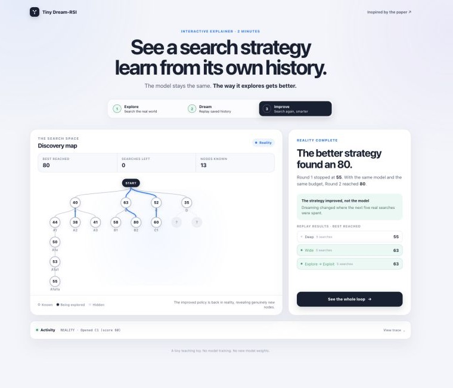

# Tiny Dream-RSI

> The model doesn't improve.
> The harness learns how to use the model better.



Round 2: the same model and search budget, but a better search strategy reaches 80 instead of 55.

```text
1. Explore a problem.
2. Save the search history.
3. Replay alternative search strategies against that history.
4. Pick a better strategy.
5. Explore again.
6. Repeat.
```

```bash
npm install
npm start
```

Then open http://localhost:3000

---

Inspired by the Dream-RSI paper.

This is an educational implementation.
It is not the authors' implementation and does not attempt
to reproduce their experimental results.

Licensed under the [Apache License 2.0](LICENSE).
